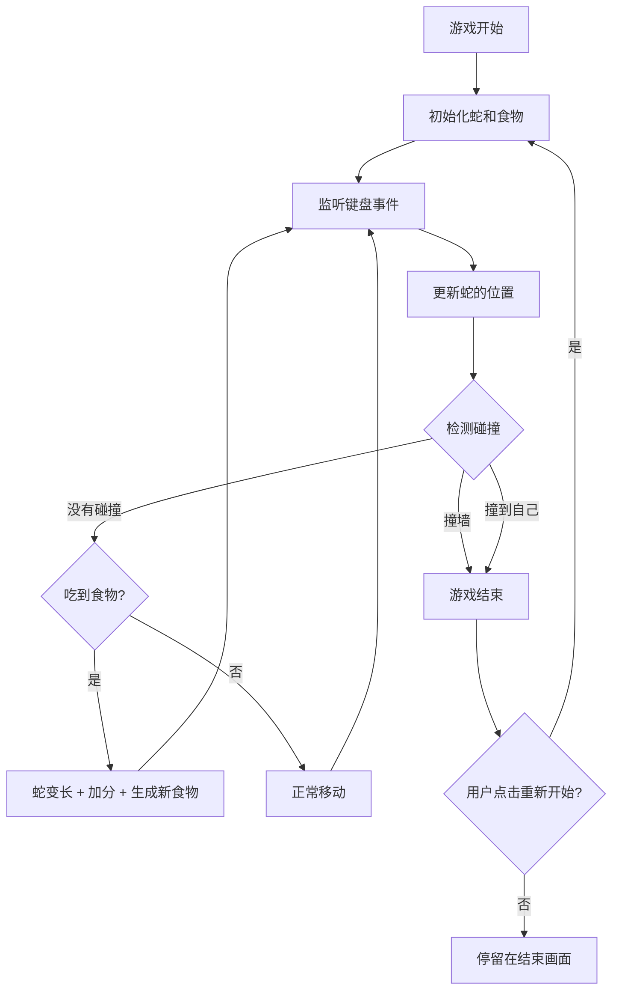

# 贪吃蛇游戏 - 产品需求文档

## 1. 产品概述
一款经典的 React 贪吃蛇游戏,用户通过键盘控制蛇的移动方向,吃到食物后蛇身变长并获得分数,撞到墙壁或自己的身体时游戏结束。支持重新开始功能,让玩家可以反复挑战。

## 2. 核心功能

### 2.1 功能模块
1. **游戏画布**: 网格化的游戏区域,显示蛇和食物
2. **蛇控制**: 通过方向键控制蛇的移动方向
3. **食物系统**: 随机生成食物,蛇吃到后变长并加分
4. **碰撞检测**: 检测蛇是否撞到墙壁或自己的身体
5. **分数系统**: 实时显示当前得分
6. **游戏状态**: 开始、进行中、结束状态管理
7. **重新开始**: 游戏结束后可以重新开始游戏

### 2.2 页面详情
| 页面名称 | 模块名称 | 功能描述 |
|---------|---------|---------|
| 游戏页面 | 游戏画布 | 显示 20x20 网格,蛇和食物渲染 |
| 游戏页面 | 分数显示 | 实时显示当前得分 |
| 游戏页面 | 游戏状态 | 显示"游戏进行中"或"游戏结束" |
| 游戏页面 | 控制提示 | 显示键盘控制说明 |
| 游戏页面 | 重新开始按钮 | 游戏结束后显示,点击重新开始 |

## 3. 核心流程

### 3.1 游戏主流程

## 4. 用户界面设计

### 4.1 设计风格
- **主题**: 霓虹复古风格,深色背景配明亮的霓虹色
- **主色调**: 深紫色背景 #1a0a2e
- **强调色**: 霓虹绿色 #00ff88 (蛇), 霓虹粉色 #ff0066 (食物)
- **字体**: 等宽像素风格字体,增加复古游戏感
- **布局**: 居中显示,游戏画布上方显示分数

### 4.2 视觉效果
- 蛇身使用渐变霓虹绿色,头部稍亮
- 食物使用闪烁的霓虹粉色方块
- 游戏结束时有明显的红色警告效果
- 添加网格线增强游戏区域感
- 蛇移动时有轻微的发光效果

### 4.3 响应式设计
- 桌面端优先设计
- 游戏画布固定大小,居中显示
- 在小屏幕上允许横向滚动
